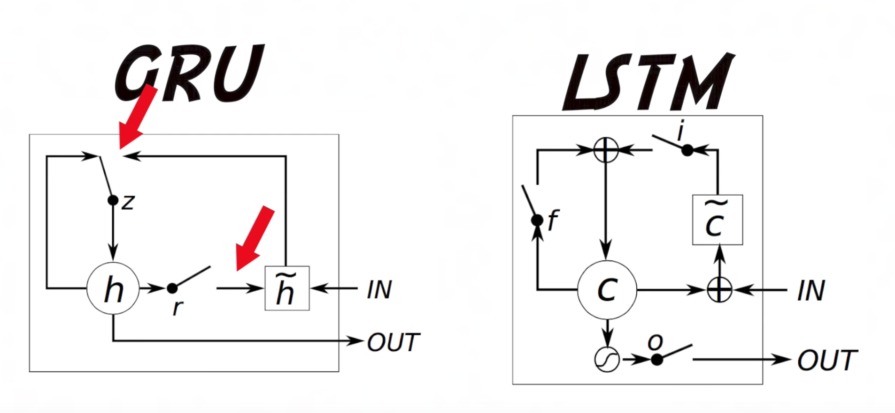

The goal is to build a chatbot that can answer any question you give it.  
We will attempt to do this using [Keras](https://keras.io/).

## Motivation
Google is great, but when you're wondering about the tail region of the
magnetosphere, an expert chatbot might be better!  Research papers are great:
they document the results and progress of a particular individual or team
in a given area of inquiry.  However, anyone who has spent time mastering
a particular subject matter, reading through and dissecting a paper's contents
can take the better part of a day (or worse), especially when new to the field.
And this is sometimes before you decide that the paper did not really answer
your questions like you thought it would.  

Wouldn't it be great to just have an expert chatbot that could read through the paper,
summarize it, and answer all your questions?!  At the least, this could help prioritize
which papers to focus on and weed out ones that are not worth the time investment.

Domain-specific chatbots are within the realm of possibility.  

## Data
Did Siraj make it clear where he got the data in the video?  Not sure... I got it 
from [research.fb.com](https://research.fb.com/downloads/babi/).

Oh, in the links, there is a link to the 
[how\_to\_make\_a\_chatbot](https://github.com/llSourcell/How_to_make_a_chatbot) challenge.

## Dynamic Memory Networks
As of mid-year 2017, DMNs are considered state-of-the-art in Q&A systems.  
Their utility stems from using two types of memory modules: semanatic and episodic.  
The two modules are inspired by [episodic memory](https://en.wikipedia.org/wiki/Episodic_memory)
and [semantic memory](https://en.wikipedia.org/wiki/Semantic_memory) as they relate
to the [hippocampus](https://en.wikipedia.org/wiki/Hippocampus).

> "Semantic memory refers to general world knowledge that we have accumulated throughout our lives. Semantic memory is distinct from episodic memory, which is our memory of experiences and specific events that occur during our lives, from which we can recreate at any given point.[3] For instance, semantic memory might contain information about what a cat is, whereas episodic memory might contain a specific memory of petting a particular cat."  --Dr. WizzlePizzle, PhDizzle

## GRU Notes
A GRU cell is like a LSTM cell, but uses only 2 gates ("update" and "reset"), making it more computationally
efficient.

* Update Gate: u[i] = sigmoid(W[u]x[i] + U[u]h[i-1] + b[u])
* r[i] = sigmoid(W[r]x[i] + U[r]h[i-1] + b[r])
* g[i] = tanh(W[g]x[i] + r[i]\*U[g]h[i-1] + b[g])
* h[i] = u[i]\*g[i] + (1-u[i])\*h[i-1]

The update gate is a single-layer neural network. It can learn to ignore the current time stop, or pass
it on through. 

## Input Module
Fact and Question vector are extracted form the Input Module.

## Question Module
Proceses the question posed to it word by word. Uses same GRU as the Input Module. 

## Episodic Memory Module
The fact and question vectors extracted from the Input Module are input into the Episodic
Memory Module (EMM).  The EMM is composed of two GRUs: an inner GRU and an outer GRU.  

The inner GRU generates "episodes" by passing over the fact vectors using an attention
function, which scores each fact between 0 and 1, to decide which facts to ignore (the ones
with low scores).  From this, the inner GRU puts together an episode, which can be thought of 
as a summary of its findings.  The outer GRU takes in this episode.  The inner GRU then does
another pass, and composes another episode for the outer GRU. Multiple passes allows the EMM
to really focus on what is important.

## Papers
2015: Weston, Chopra, & Borders: [Memory Networks](https://arxiv.org/pdf/1410.3916.pdf)

## Some Links
* https://yerevann.github.io/2016/02/05/implementing-dynamic-memory-networks/
* http://www.wildml.com/2016/01/attention-and-memory-in-deep-learning-and-nlp/
* https://github.com/domluna/memn2n

