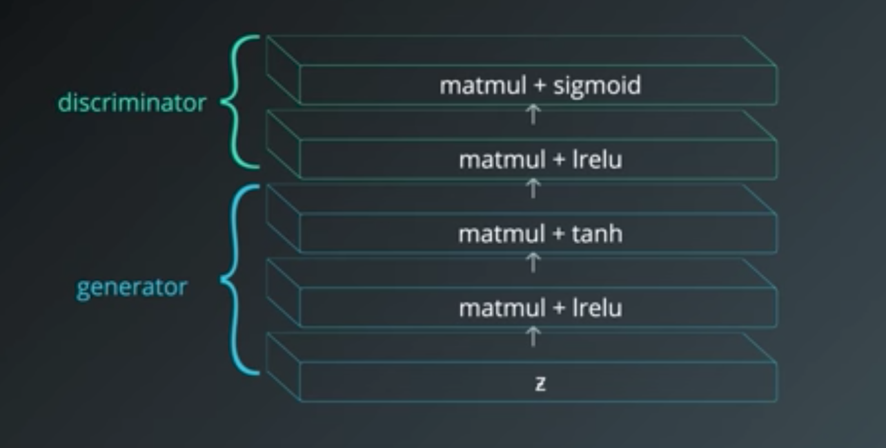
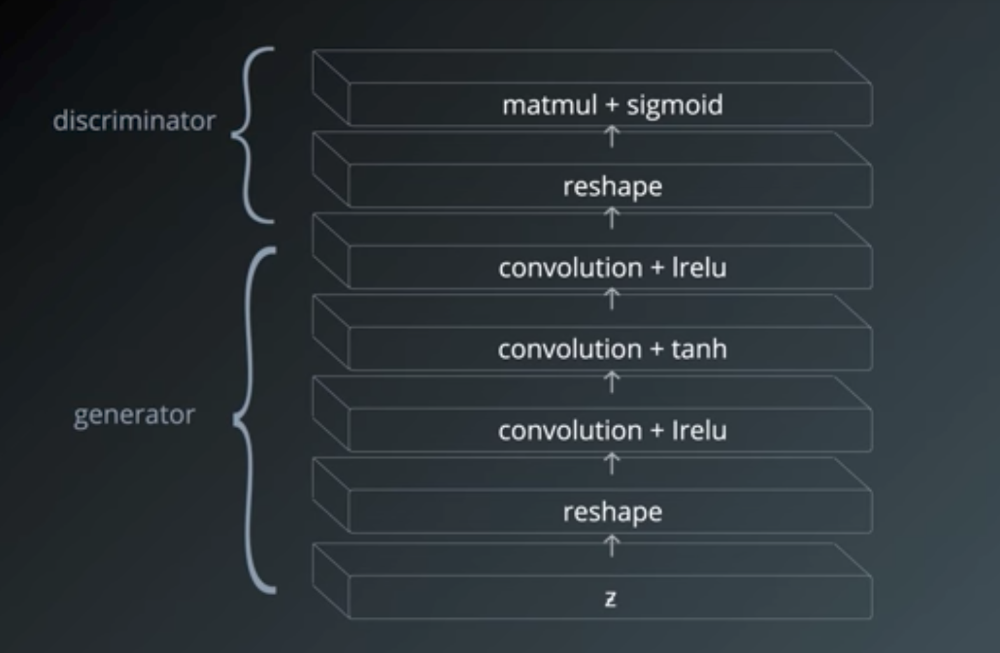

The generator takes random noise as its input and outputs images.  The goal is to output realistic images.
The discriminator guides the generator in this process by classifying whether or not it believe an image is real
or fake.  The generator's reward comes from successfully tricking the discriminator, whereas the discriminator's
reward comes from successfully classifying images.

To understand GANs is to understand their equivalent game theoretical equilibria...
We attempt to find equilibria by pitting two cost functions against each other, but this
often does not result in a truly optimal solution.  This is a major area of research
right now.

## Small Images: Fully-Connected Layers are OK
GANs are hard to train, thus using an appropriate architecture becomes essential.  For small images,
you might be able to get away with fully-connected layers.  

* discriminator and generator should both have at least one hidden layer 
  - this ensures both layers have the universal approximation property and, thus, can approximate any probability distribution
* leaky ReLUs are a good choice of activation function on the hidden units
  - allows the gradient to flow through the architecture
* a tanh activation on the generator output 
  - scales the generator output / discriminator input to be between -1 and 1
* a sigmoid activation should be used on the discriminator output
  - necessary that the output represents a probability

## Large Images: Fully-Connected Layers are NOT OK!
To scale up to large images, we must use convolutional networks.  

## Intro to GANs Exercize
* see miniprojects
* [paper](https://arxiv.org/pdf/1606.03498.pdf) on making better images than produced in the exercize
* going further: 
  - add more layers to discriminator and generator: what happens?  
  - at 3 layers, network can no longer train: try batch normalization
  - [paper](https://arxiv.org/abs/1502.03167) on batch normalization

